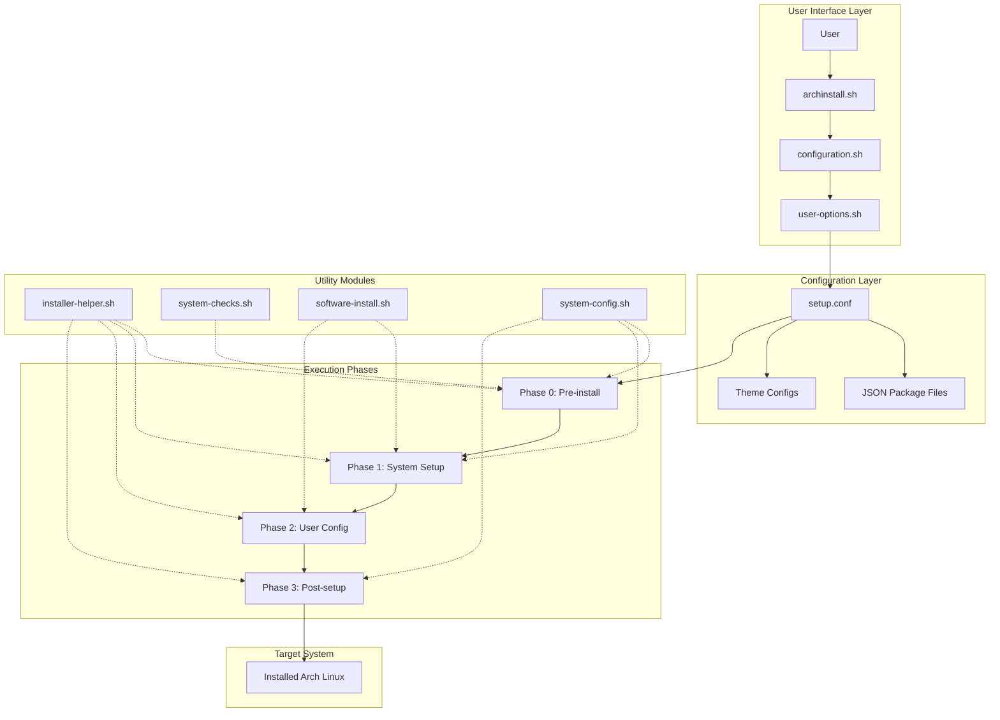
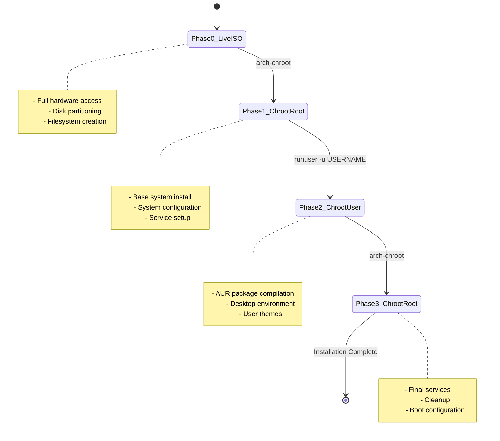
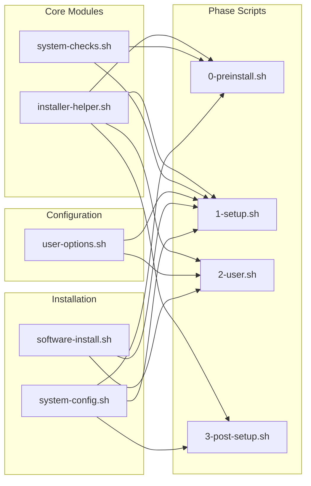
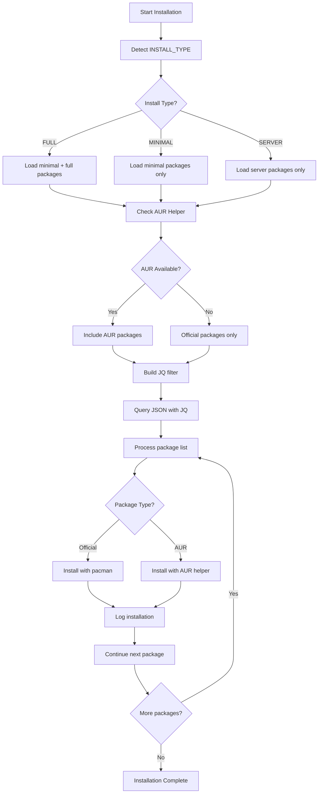
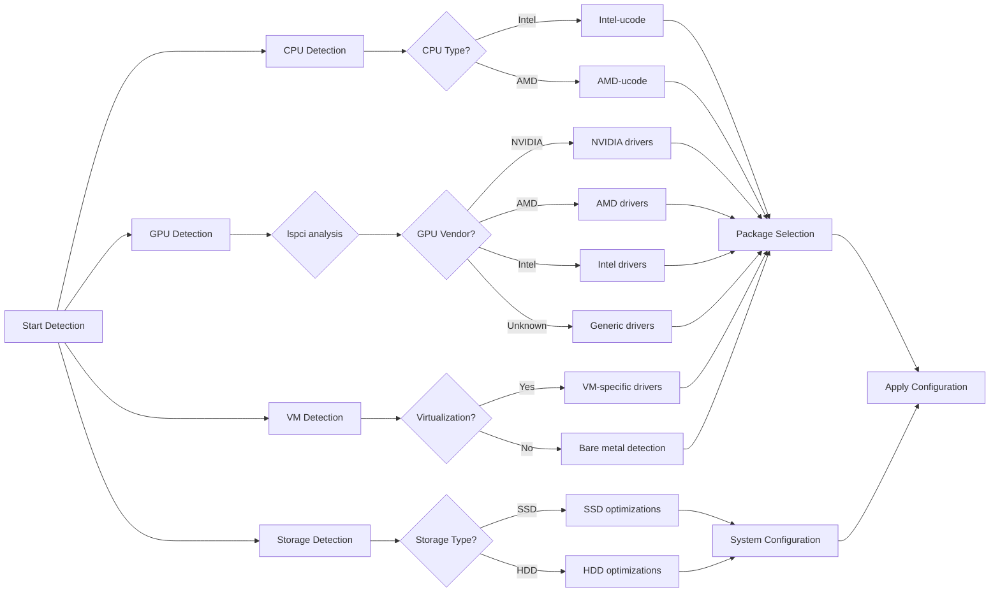
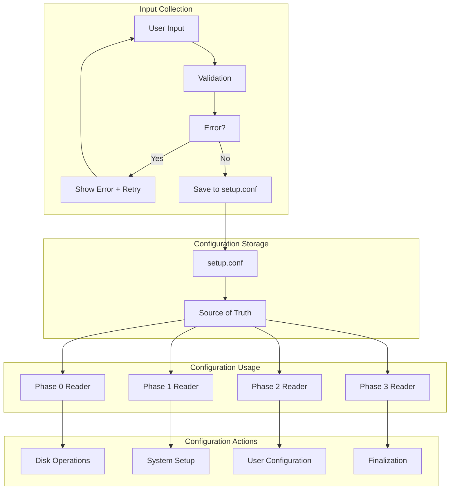

# System Architecture

This document describes the complete architecture of ArchInstaller, including design decisions, data flow, and modular structure.

---

## Architectural Overview

### Design Principles

1. **Modularity**: Each script has a single, well-defined responsibility
2. **Phase Separation**: Installation divided into 4 sequential phases
3. **Centralized Configuration**: Single `setup.conf` file as source of truth
4. **Automatic Detection**: Hardware detected automatically whenever possible
5. **Idempotency**: Functions can be executed multiple times safely
6. **Complete Logging**: Everything logged to `install.log` for debugging

---

## 4-Phase Execution Model

### Why 4 Phases?

The installation is divided into phases due to different execution contexts:

```
┌──────────────────────────────────────────────────────────────┐
│ PHASE 0: Live ISO Environment (Before Chroot)               │
│ - Arch ISO live system                                      │
│ - Full hardware access                                      │
│ - No installed system yet                                   │
└──────────────────────────────────────────────────────────────┘

┌──────────────────────────────────────────────────────────────┐
│ PHASE 1: Chroot as Root                                     │
│ - Inside freshly installed system                           │
│ - Root privileges                                            │
│ - System configuration                                       │
└──────────────────────────────────────────────────────────────┘

┌──────────────────────────────────────────────────────────────┐
│ PHASE 2: As Normal User                                     │
│ - Created user context                                       │
│ - AUR package installation                                   │
│ - User configurations                                        │
└──────────────────────────────────────────────────────────────┘

┌──────────────────────────────────────────────────────────────┐
│ PHASE 3: Chroot as Root (Finalization)                      │
│ - Back to root context                                       │
│ - System service configuration                               │
│ - Final cleanup                                              │
└──────────────────────────────────────────────────────────────┘
```

### Phase Transitions

```bash
# In installer-helper.sh -> sequence()
sequence() {
    # PHASE 0: Live ISO
    . "$SCRIPTS_DIR"/0-preinstall.sh

    # PHASE 1: Root in chroot
    arch-chroot /mnt "$HOME"/archinstaller/scripts/1-setup.sh

    # PHASE 2: User in chroot (only if not SERVER)
    if [[ ! "$INSTALL_TYPE" == SERVER ]]; then
        arch-chroot /mnt /usr/bin/runuser -u "$USERNAME" -- \
            /home/"$USERNAME"/archinstaller/scripts/2-user.sh
    fi

    # PHASE 3: Root in chroot again
    arch-chroot /mnt "$HOME"/archinstaller/scripts/3-post-setup.sh
}
```

**Rationale**: AUR packages cannot be compiled as root. We need to switch to user context in PHASE 2.

---

## Module System (Utility Scripts)

### 1. installer-helper.sh

**Responsibility**: Generic helper functions

```
┌─────────────────────────────────────────────────────────┐
│ installer-helper.sh                                     │
├─────────────────────────────────────────────────────────┤
│ • exit_on_error()      → Error handling                 │
│ • show_logo()          → Visual display                 │
│ • multiselect()        → Multi-select menu              │
│ • select_option()      → Single-select menu             │
│ • sequence()           → Orchestrates 4 phases          │
│ • set_option()         → Saves to setup.conf            │
│ • source_file()        → Loads file with validation     │
│ • end_script()         → Finalizes and copies logs      │
└─────────────────────────────────────────────────────────┘
```

**Design Pattern**: Helper/Utility Module - reusable stateless functions.

---

### 2. system-checks.sh

**Responsibility**: Precondition verification

```
┌─────────────────────────────────────────────────────────┐
│ system-checks.sh                                        │
├─────────────────────────────────────────────────────────┤
│ • root_check()         → Verifies root privileges       │
│ • arch_check()         → Verifies Arch Linux            │
│ • pacman_check()       → Verifies pacman lock           │
│ • docker_check()       → Prevents container execution   │
│ • mount_check()        → Verifies /mnt mount            │
│ • background_checks()  → Executes all checks            │
└─────────────────────────────────────────────────────────┘
```

**Design Pattern**: Guard Clauses - fail fast if preconditions not met.

**When to Execute**:
- `background_checks()`: At the start of `configuration.sh`
- `mount_check()`: Before phases 1-3 (which need /mnt mounted)

---

### 3. user-options.sh

**Responsibility**: Interactive configuration collection

```
┌─────────────────────────────────────────────────────────┐
│ user-options.sh                                         │
├─────────────────────────────────────────────────────────┤
│ • set_password()           → Collects password with confirmation │
│ • user_info()              → Name, username, hostname   │
│ • install_type()           → FULL/MINIMAL/SERVER        │
│ • aur_helper()             → AUR helper selection       │
│ • desktop_environment()    → Reads available JSONs      │
│ • disk_select()            → Selects disk + percentage  │
│ • filesystem()             → btrfs/ext4/luks            │
│ • set_btrfs()              → Defines subvolumes         │
│ • timezone()               → Detects and confirms       │
│ • locale_selection()       → System language            │
│ • keymap()                 → Keyboard layout            │
│ • show_configurations()    → Summary + allows redo      │
└─────────────────────────────────────────────────────────┘
```

**Design Pattern**: Wizard/Step-by-Step Configuration

**Validation Flow**:
```
Input → Validation → Retry if invalid → set_option() → Next step
```

**Show Configurations**: Allows user to review ALL choices and redo any step before proceeding. This prevents reinstallations due to configuration errors.

---

### 4. software-install.sh

**Responsibility**: Software and driver installation

```
┌─────────────────────────────────────────────────────────┐
│ software-install.sh                                     │
├─────────────────────────────────────────────────────────┤
│ BASE INSTALLATION:                                      │
│ • arch_install()               → Pacstrap base system   │
│ • bootloader_install()         → Bootloader prereqs     │
│ • network_install()            → NetworkManager + VPNs │
│ • base_install()               → Reads base.json       │
│                                                         │
│ HARDWARE DETECTION:                                     │
│ • microcode_install()          → Intel/AMD automatic   │
│ • detect_vm()                  → VM detection          │
│ • detect_gpu()                 → GPU type detection    │
│ • detect_hybrid_graphics()     → Hybrid graphics check │
│ • graphics_install()           → JSON-based drivers    │
│ • install_gpu_from_json()      → GPU driver installer  │
│                                                         │
│ DESKTOP & THEMES:                                       │
│ • install_fonts()              → Reads fonts.json      │
│ • desktop_environment_install()→ Reads DE JSON         │
│ • user_theming()               → Applies configs/themes│
│ • btrfs_install()              → Snapper, grub-btrfs   │
│                                                         │
│ I3-WM SPECIFIC:                                         │
│ • i3wm_battery_notifications() → Battery alerts        │
│ • i3wm_auto_suspend_hibernate()→ Auto suspend/hibernate│
│                                                         │
│ AUR:                                                    │
│ • aur_helper_install()         → Compiles AUR helper   │
│                                                         │
│ SERVICES:                                               │
│ • essential_services()         → Enables all services  │
└─────────────────────────────────────────────────────────┘
```

**Design Pattern**: Repository Pattern (JSON as package "repositories")

**Hardware Auto-Detection**:
```bash
# Microcode
proc_type=$(lscpu)
if grep -E "GenuineIntel" <<<"${proc_type}"; then
    pacman -S intel-ucode
elif grep -E "AuthenticAMD" <<<"${proc_type}"; then
    pacman -S amd-ucode
fi

# GPU Detection (JSON-based)
# 1. Check for VM (VirtualBox, VMware, QEMU)
# 2. Detect GPU type from lspci
# 3. Check for hybrid graphics (NVIDIA + Intel)
# 4. For NVIDIA: offer driver choice (proprietary, open-dkms, nouveau)
# 5. Install packages from gpu-drivers.json

detect_gpu() {
    local gpu_info=$(lspci | grep -iE "VGA|3D|Display")
    if echo "$gpu_info" | grep -iE "NVIDIA|GeForce"; then echo "nvidia"
    elif echo "$gpu_info" | grep -iE "Radeon|AMD|ATI"; then echo "amd"
    elif echo "$gpu_info" | grep -iE "Intel.*Graphics"; then echo "intel"
    else echo "unknown"; fi
}

# Install from JSON file
install_gpu_from_json "$(detect_gpu)" "$driver_variant"
```

**Intelligent Package Installation**:
```bash
# For each package:
1. Check if already installed (skip if yes)
2. Check if in official repo: pacman -Si <package>
   - If YES → use sudo pacman -S (official repo)
   - If NO → use AUR helper (if configured)
3. Provide warnings if package not found and no AUR helper
```

This ensures:
- Official packages installed with proper permissions (sudo)
- AUR packages installed via AUR helper
- No silent failures
- Clear error messages

---

### 5. system-config.sh

**Responsibility**: System configuration (disk, locale, users, bootloader)

```
┌─────────────────────────────────────────────────────────┐
│ system-config.sh                                        │
├─────────────────────────────────────────────────────────┤
│ DISK AND FILESYSTEM:                                    │
│ • mirrorlist_update()      → Reflector/rankmirrors     │
│ • format_disk()            → sgdisk partitioning       │
│ • create_filesystems()     → mkfs.vfat/ext4/btrfs      │
│ • do_btrfs()               → Subvolumes + mounting     │
│                                                         │
│ OPTIMIZATIONS:                                          │
│ • low_memory_config()      → Intelligent swap config   │
│ • cpu_config()             → Makeflags multicore       │
│                                                         │
│ SYSTEM:                                                 │
│ • locale_config()          → Locale, timezone, keymap  │
│ • extra_repos()            → Multilib, chaotic-aur     │
│ • add_user()               → useradd + groups          │
│                                                         │
│ BOOTLOADER:                                             │
│ • grub_config()            → Configures GRUB           │
│ • display_manager()        → SDDM/GDM/LightDM + themes │
│                           → Auto-installs LightDM if missing │
│                           → Creates config files if needed │
│                           → Conditional theming (FULL only) │
│                                                         │
│ ADVANCED:                                               │
│ • snapper_config()         → Btrfs snapshots           │
│ • configure_tlp()          → Laptop power management   │
│ • plymouth_config()        → Boot splash               │
│ • configure_base_skel()    → Base skel configs         │
│ • configure_pam_faillock() → PAM password attempts     │
│ • configure_pipewire()     → PipeWire audio server     │
└─────────────────────────────────────────────────────────┘
```

**Design Pattern**: Configuration Management

**GPT Partitioning**:
```
UEFI:
┌─────────────┬──────────────────────────────────────┐
│ EFIBOOT     │ ROOT                                 │
│ 1GB (EF00)  │ Percentage of available (8300)       │
│ FAT32       │ ext4/btrfs/LUKS                      │
└─────────────┴──────────────────────────────────────┘

BIOS:
┌─────────────┬──────────────────────────────────────┐
│ BIOSBOOT    │ ROOT                                 │
│ 256MB(EF02) │ Percentage of available (8300)       │
│ (no FS)     │ ext4/btrfs/LUKS                      │
└─────────────┴──────────────────────────────────────┘
```

**Disk Usage Percentage**:
- User can specify percentage (5-100%) of disk to use
- Percentage applies to **available space** after boot partition
- If 100%: Uses all remaining space (default)
- If <100%: Calculates size based on percentage of available space
- Example: 500GB disk, 50% selected, 1GB EFI → ~249GB ROOT partition

**Btrfs Subvolumes**:
```
@              → /           (root)
@home          → /home       (user data)
@snapshots     → /.snapshots (Snapper snapshots)
@var_log       → /var/log    (logs, CoW disabled)
@var_cache     → /var/cache  (cache, CoW disabled)
@var_tmp       → /var/tmp    (temp, CoW disabled)
@docker        → /var/lib/docker
@flatpak       → /var/lib/flatpak
```

**Rationale**: Separate subvolumes allow selective snapshots and better management.

---

## Configuration System

### setup.conf - Central File

```bash
# Generated by configuration.sh
# Read by ALL phases

# User
REAL_NAME="John Doe"
USERNAME=john
PASSWORD=hashed_password
NAME_OF_MACHINE=myarch

# Installation
INSTALL_TYPE=FULL          # FULL, MINIMAL or SERVER
AUR_HELPER=yay             # yay, paru, picaur, etc.
DESKTOP_ENV=kde            # kde, gnome, i3-wm, etc.

# Disk
DISK=/dev/sda
DISK_USAGE_PERCENT=100     # 5-100% of available space
FS=btrfs                   # btrfs, ext4 or luks
SUBVOLUMES=(@ @home @snapshots ...)
MOUNT_OPTION=defaults,noatime,compress=zstd,ssd,discard=async,commit=120

# Localization
TIMEZONE=America/New_York
LOCALE=en_US.UTF-8
KEYMAP=us

# LUKS (if FS=luks)
LUKS_PASSWORD=***
ENCRYPTED_PARTITION_UUID=partition-uuid
```

**Access Pattern**:
```bash
# All scripts do:
source "$HOME"/archinstaller/configs/setup.conf

# Then use variables directly:
useradd -m -s /bin/bash "$USERNAME"
```

---

## JSON Package System

### JSON File Structure

```json
{
  "minimal": {
    "pacman": [
      {"package": "firefox"},
      {"package": "vim"}
    ],
    "aur": [
      {"package": "yay"}
    ]
  },
  "full": {
    "pacman": [
      {"package": "libreoffice-fresh"},
      {"package": "gimp"}
    ],
    "aur": [
      {"package": "visual-studio-code-bin"}
    ]
  }
}
```

### Installation Logic

```bash
# Define JQ filters based on INSTALL_TYPE
if [[ "$INSTALL_TYPE" == "FULL" ]]; then
    FILTER=".minimal.pacman[].package, .full.pacman[].package"
else
    FILTER=".minimal.pacman[].package"
fi

# If AUR helper installed, include AUR packages
if [[ "$AUR_HELPER" != NONE ]]; then
    FILTER="$FILTER, .minimal.aur[].package"
    [[ "$INSTALL_TYPE" == "FULL" ]] && FILTER="$FILTER, .full.aur[].package"
fi

# Install
jq -r "$FILTER" package.json | while read -r pkg; do
    pacman -S "$pkg" --noconfirm --needed
done
```

**Rationale**: JQ allows flexible JSON queries. Separating minimal/full allows lightweight or complete installations.

---

## Security and Validations

### 1. User Input Validation

```bash
# Username: regex validated
[[ "${username,,}" =~ ^[a-z_]([a-z0-9_-]{0,31}|[a-z0-9_-]{0,30}\$)$ ]]

# Hostname: regex validated
[[ "${hostname,,}" =~ ^[a-z][a-z0-9_.-]{0,62}[a-z0-9]$ ]]

# Password: confirmation required
set_password() {
    read -rs -p "Enter password: " PASS1
    read -rs -p "Re-enter password: " PASS2
    [[ "$PASS1" == "$PASS2" ]] || { echo "No match!"; set_password; }
}
```

### 2. Pre-Installation Checks

```bash
# Must be root
[[ "$(id -u)" != "0" ]] && exit 1

# Must be Arch
[[ ! -e /etc/arch-release ]] && exit 1

# Pacman cannot be locked
[[ -f /var/lib/pacman/db.lck ]] && exit 1

# Does not support Docker
[[ -f /.dockerenv ]] && exit 1
```

### 3. Error Handling

```bash
exit_on_error() {
    exit_code=$1
    last_command=${*:2}
    if [ "$exit_code" -ne 0 ]; then
        echo "\"${last_command}\" failed with code ${exit_code}."
        exit "$exit_code"
    fi
}

# Usage:
pacstrap /mnt base
exit_on_error $? pacstrap /mnt base
```

---

## Themes and Custom Configurations

### Theming System

```
configs/
├── base/                           # Shared configs
│   ├── etc/snapper/configs/root   # Snapper config
│   └── usr/share/plymouth/themes/ # Plymouth themes
├── kde/
│   ├── home/                       # User dotfiles
│   └── kde.knsv                    # Konsave profile
├── awesome/
│   ├── home/.config/awesome/       # Awesome WM config
│   └── etc/xdg/awesome/            # Global config
└── i3-wm/
    └── etc/                        # i3 configs
```

**Theme Application**:
```bash
user_theming() {
    case "$DESKTOP_ENV" in
        kde)
            cp -r ~/archinstaller/configs/kde/home/. ~/
            pip install konsave
            konsave -i ~/archinstaller/configs/kde/kde.knsv
            konsave -a kde
            ;;
        awesome)
            cp -r ~/archinstaller/configs/awesome/home/. ~/
            sudo cp -r ~/archinstaller/configs/awesome/etc/xdg/awesome /etc/xdg/
            ;;
    esac
}
```

---

## Implemented Optimizations

### 1. Parallel Compilation

```bash
nc=$(grep -c ^processor /proc/cpuinfo)
sed -i "s/^#\(MAKEFLAGS=\"-j\)2\"/\1$nc\"/" /etc/makepkg.conf
```

### 2. Mirror Optimization

```bash
# Reflector: selects 20 fastest mirrors from country
reflector -a 48 -c "$iso" -f 5 -l 20 --sort rate --save /etc/pacman.d/mirrorlist

# Fallback: manual rankmirrors
rankmirrors -n 5 /etc/pacman.d/mirrorlist
```

### 3. Intelligent Swap Configuration

The system intelligently configures swap based on hardware analysis:

```bash
# Decision logic based on RAM, storage type (SSD/HDD), and installation type
TOTAL_MEM=$(grep -i 'memtotal' /proc/meminfo | grep -o '[[:digit:]]*')
IS_SSD=$([[ $(lsblk -n --output ROTA "${DISK}") == "0" ]] && echo 1 || echo 0)
```

**Decision Table**:

| RAM | SSD | HDD | Strategy |
|-----|-----|-----|----------|
| <4GB | ZRAM (2x) | ZRAM (2x) | ZRAM critical for low RAM |
| 4-8GB | ZRAM (2x) | ZRAM + 2GB swap | ZRAM primary, file backup |
| 8-16GB | ZRAM (1x) | 4GB swap file | Light swap needs |
| 16-32GB | 2GB swap | 4GB swap | Hibernation support |
| >32GB | 1GB swap | 2GB swap | Minimal swap |

**Special Cases**:
- SERVER installations always get 4GB swap file
- Swap file created with `mkswap --file` (handles btrfs nocow)
- GRUB `resume=` parameter added automatically for hibernation

**Rationale**: Adaptive configuration based on actual hardware provides optimal performance. ZRAM is preferred for SSDs (reduces wear), swap files for HDDs (ZRAM less beneficial).

### 4. Btrfs Mount Options

```bash
# SSD detected
if [[ "$(lsblk -n --output ROTA)" -eq "0" ]]; then
    MOUNT_OPTION="defaults,noatime,compress=zstd,ssd,discard=async"
else
    MOUNT_OPTION="defaults,noatime,compress=zstd,discard=async"
fi
```

- `noatime`: Don't update access time (performance)
- `compress=zstd`: Transparent compression
- `ssd`: SSD optimizations
- `discard=async`: Asynchronous TRIM (better performance)

---

## Data Flow & Visual Architecture

### High-Level Architecture Diagram



### Phase Transition Flow



### Module Dependencies



### Package Installation Flow



### Hardware Detection Pipeline



### Configuration Management Flow



---

## Important Architectural Decisions

### 1. Why JSON for Packages?

**Alternatives considered**: Shell arrays, TOML, YAML

**Chosen**: JSON with JQ

**Rationale**:
- JQ is available on Arch ISO
- Flexible queries (filter by minimal/full, pacman/aur)
- Easy to edit manually
- Clear hierarchical structure

### 2. Why 4 Separate Phases?

**Alternative**: Monolithic script

**Chosen**: 4 distinct phases

**Rationale**:
- AUR cannot be installed as root
- Separation of contexts (live ISO vs chroot)
- Better for debugging (can re-run specific phases)
- Separate logs per phase

### 3. Why setup.conf?

**Alternative**: Environment variables, database

**Chosen**: Simple text file

**Rationale**:
- Simple to read/write in bash
- Can be manually edited if needed
- Survives context changes (chroot)
- Human-readable for debugging

---

## API Documentation - Internal Functions

### Core Helper Functions (installer-helper.sh)

#### Error Handling & Utilities
```bash
# Exits script with error message and logging
exit_on_error <exit_code> <command_description>

# Displays ASCII art logo
show_logo()

# Creates multi-select menu with checkboxes
multiselect <title> <options_array>

# Creates single-select menu
select_option <default_choice> <num_options> <options_array>

# Orchestrates all 4 installation phases
sequence()

# Saves key-value pair to setup.conf
set_option <key> <value>

# Safely sources file with validation
source_file <file_path>

# Finalizes script and copies logs
end_script()
```

#### Usage Examples
```bash
# Error handling pattern
pacstrap /mnt base base-devel
exit_on_error $? "Installing base system"

# Menu creation
options=("Option 1" "Option 2" "Option 3")
select_option 0 3 "${options[@]}"
choice=${options[$?]}

# Configuration persistence
set_option INSTALL_TYPE "FULL"
set_option DESKTOP_ENV "kde"
```

### System Check Functions (system-checks.sh)

#### Precondition Validation
```bash
# Verifies script is running as root
root_check() -> boolean

# Checks if running on Arch Linux
arch_check() -> boolean

# Ensures pacman database is not locked
pacman_check() -> boolean

# Prevents execution inside Docker containers
docker_check() -> boolean

# Verifies /mnt is mounted for chroot operations
mount_check() -> boolean

# Executes all background checks
background_checks() -> exit_code
```

#### Validation Patterns
```bash
# Usage in scripts
if ! background_checks; then
    echo "System requirements not met"
    exit 1
fi

# Check specific conditions
if ! mount_check; then
    echo "System not properly mounted"
    exit 1
fi
```

### Configuration Functions (user-options.sh)

#### Input Collection & Validation
```bash
# Secure password input with confirmation
set_password <prompt_text> -> string

# Collects user information with validation
user_info() -> {name, username, hostname}

# Installation type selection
install_type() -> "FULL"|"MINIMAL"|"SERVER"

# AUR helper selection
aur_helper() -> helper_name

# Desktop environment selection (JSON-based)
desktop_environment() -> de_name

# Disk selection and percentage configuration
disk_select() -> {disk, percentage}

# Filesystem selection
filesystem() -> "btrfs"|"ext4"|"luks"

# Btrfs subvolume configuration
set_btrfs() -> subvolumes_array

# Timezone detection and confirmation
timezone() -> timezone_string

# Locale and keyboard configuration
locale_selection() -> {locale, keymap}

# Configuration review and editing
show_configurations() -> allows_reconfiguration
```

#### Input Validation Examples
```bash
# Username validation (alphanumeric, max 32 chars)
[[ "${username,,}" =~ ^[a-z_]([a-z0-9_-]{0,31}|[a-z0-9_-]{0,30}\$)$ ]]

# Hostname validation
[[ "${hostname,,}" =~ ^[a-z][a-z0-9_.-]{0,62}[a-z0-9]$ ]]

# Password strength check
if [[ ${#password} -lt 8 ]]; then
    echo "Password must be at least 8 characters"
fi
```

